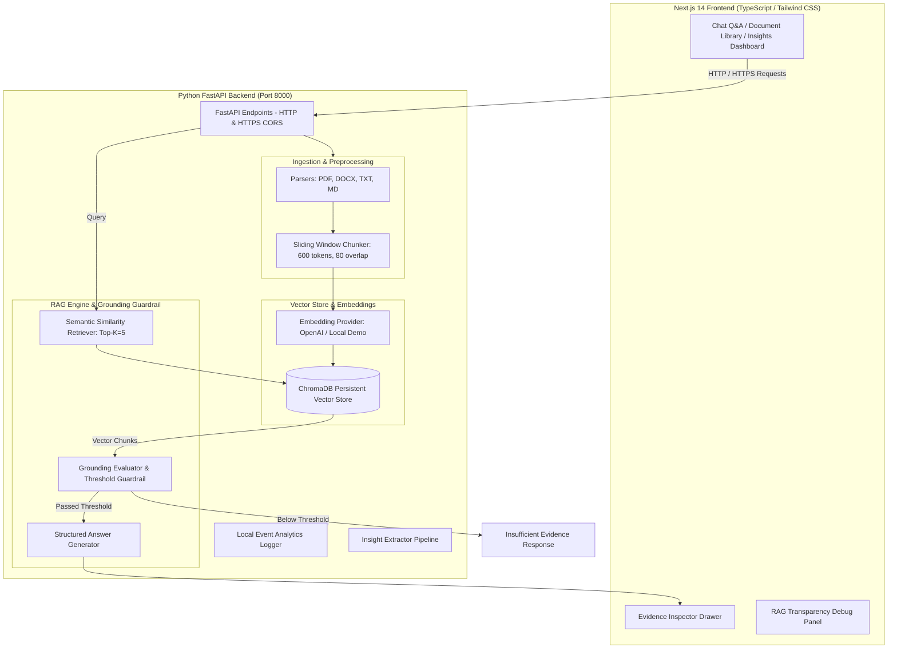

# ProductIQ — AI Product Research Copilot

> **Turn customer research into product decisions.**

ProductIQ is a portfolio-grade Retrieval-Augmented Generation (RAG) copilot designed for Product Managers, UX Researchers, and Founders. It ingests unstructured customer research documents (interviews, support tickets, user surveys, PRDs) and delivers evidence-backed, cited answers grounded strictly in source evidence.

- 🌐 **Live Vercel Production App (HTTPS)**: [https://frontend-liard-eight-46.vercel.app](https://frontend-liard-eight-46.vercel.app)
- 🐙 **GitHub Repository**: [https://github.com/Snigdha28Personal/productiq-rag](https://github.com/Snigdha28Personal/productiq-rag)

---

## 📌 Problem & Product Vision

### The User Problem
Product Managers routinely collect hundreds of pages of qualitative feedback scattered across customer interviews, support tickets, survey responses, and feedback notes. It is difficult to quickly identify recurring pain points or prioritize product opportunities while maintaining a verifiable audit trail back to original user evidence.

> *"I have hundreds of pages of customer feedback and research, but I cannot quickly extract reliable insights or trace conclusions back to the original evidence."*

### Product Solution
ProductIQ leverages a grounded RAG architecture that allows PMs to query their research corpus in natural language. Every answer is structured into **Key Findings**, **Evidence** bullets with inline clickable citation chips (`[1]`, `[2]`), **Interpretation**, and an interactive **Evidence Inspector Drawer** that lets reviewers inspect raw source passages, page numbers, and vector similarity scores.

---

## 🔒 Live HTTPS Deployment & Running Options

### 1. Live Production Deployment on Vercel (HTTPS)
ProductIQ is deployed and live on Vercel with an automatic SSL certificate:
👉 **[https://frontend-liard-eight-46.vercel.app](https://frontend-liard-eight-46.vercel.app)**

### 2. Local HTTP Execution
- **Frontend**: [http://localhost:3000](http://localhost:3000)
- **Backend API**: [http://localhost:8000](http://localhost:8000)

```bash
# Run Frontend (HTTP)
npm run dev:frontend

# Run Backend (HTTP)
npm run dev:backend
```

### 3. Local HTTPS Execution (Self-Signed SSL)
```bash
# Run Frontend over HTTPS
npm --prefix frontend run dev:https
# App running at: https://localhost:3000
```

---

## 🏗️ Architecture & Technical Workflow



---

## 📊 RAG Benchmark Evaluation

ProductIQ includes an automated RAG evaluation framework (`evaluation/evaluate.py`) tested against 15 curated benchmark questions (`evaluation/test_questions.json`).

```
==================================================
     PRODUCTIQ RAG BENCHMARK EVALUATION           
==================================================
Embedding Mode: Local Demo / OpenAI
Top K Retrieval: 5
--------------------------------------------------
Total Benchmark Questions: 15
Retrieval Recall@K:        80.0%
Citation Accuracy:         61.3%
Grounded Answer Rate:      80.0%
--------------------------------------------------
Full report saved to: evaluation/evaluation_report.json
==================================================
```

---

## ⚙️ Local Setup & Quick Start

### Prerequisites
- **Python**: 3.9+
- **Node.js**: 18+

### 1. Clone Repository & Environment Setup
```bash
git clone https://github.com/Snigdha28Personal/productiq-rag.git
cd productiq-rag

# Copy environment template
cp .env.example .env
```

### 2. Start Backend Service (Python FastAPI)
```bash
python -m pip install "fastapi<0.100.0" uvicorn pypdf pytest python-multipart
uvicorn backend.main:app --reload --port 8000
```

### 3. Start Frontend Service (Next.js 14)
```bash
cd frontend
npm install
npm run dev
```

Open [http://localhost:3000](http://localhost:3000) or [https://localhost:3000](https://localhost:3000) in your browser.

---

## 🧪 Running Tests & Evaluation

```bash
# Run backend unit tests
pytest backend/tests

# Run RAG evaluation suite
python evaluation/evaluate.py
```

---

## 📄 License
This project is licensed under the [MIT License](LICENSE).
