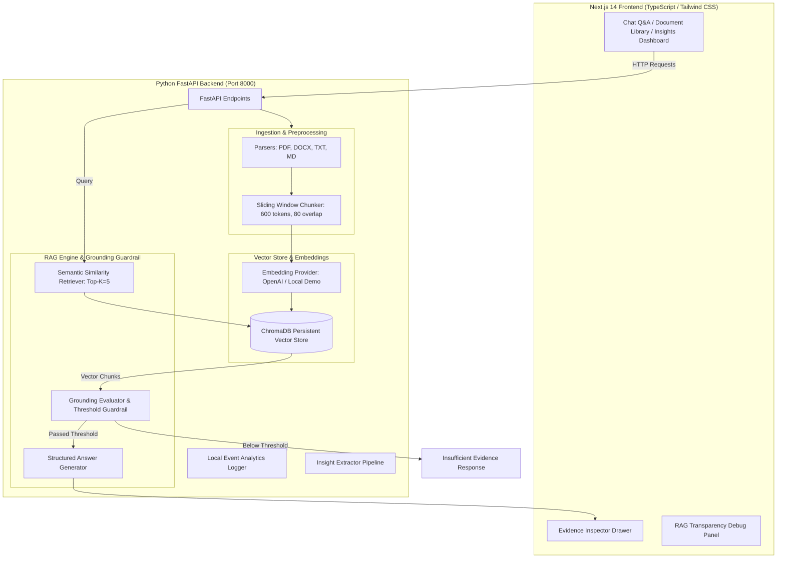

# ProductIQ — AI Product Research Copilot

> **Turn customer research into product decisions.**

ProductIQ is a portfolio-grade Retrieval-Augmented Generation (RAG) copilot designed for Product Managers, UX Researchers, and Founders. It ingests unstructured customer research documents (interviews, support tickets, user surveys, PRDs) and delivers evidence-backed, cited answers grounded strictly in source evidence.

---

## 📌 Problem & Product Vision

### The User Problem
Product Managers routinely collect hundreds of pages of qualitative feedback scattered across customer interviews, support tickets, survey responses, and feedback notes. It is difficult to quickly identify recurring pain points or prioritize product opportunities while maintaining a verifiable audit trail back to original user evidence.

> *"I have hundreds of pages of customer feedback and research, but I cannot quickly extract reliable insights or trace conclusions back to the original evidence."*

### Product Solution
ProductIQ leverages a grounded RAG architecture that allows PMs to query their research corpus in natural language. Every answer is structured into **Key Findings**, **Evidence** bullets with inline clickable citation chips (`[1]`, `[2]`), **Interpretation**, and an interactive **Evidence Inspector Drawer** that lets reviewers inspect raw source passages, page numbers, and vector similarity scores.

---

## 🚀 Key Features

1. **Multi-Format Document Ingestion**: Upload PDF, DOCX, TXT, and Markdown files with automatic text normalization and metadata extraction.
2. **1-Click "Load Demo Research"**: Immediate indexing of 5 synthetic PM research files (PDF, DOCX, TXT, MD) across customer interviews, support tickets, and enterprise procurement notes for instant 1-click evaluation.
3. **Semantic Vector Search & ChromaDB**: Chunking via a sliding-window strategy (600 tokens, 80 overlap) indexed into ChromaDB.
4. **Dual Embedding Modes**:
   - **OpenAI RAG Mode**: `text-embedding-3-small` + `gpt-4o-mini` when `OPENAI_API_KEY` is provided.
   - **Local Demo Mode**: Deterministic 128D subword n-gram cosine vectorizer enabling keyless out-of-the-box evaluation.
5. **Strict Grounding & Insufficient Evidence Guardrail**: Enforces explicit similarity thresholding. If evidence is lacking, ProductIQ explicitly states:
   > *"I couldn't find enough evidence in your uploaded research to answer this confidently."*
6. **Clickable Citations & Evidence Inspector Drawer**: Inline citation badges (`[1]`) slide out an inspector panel showing exact source document name, page number, chunk ID, and vector match score.
7. **RAG Transparency / Debug Mode**: Toggleable debug panel displaying query embedding mode, top-k, similarity threshold, and raw retrieved chunks.
8. **Insights Dashboard**: Extracted top pain points, SMB vs Enterprise segment breakdown, and high-impact feature request matrices with evidence confidence tags.
9. **Local Product Analytics**: Built-in telemetry tracking questions asked, documents processed, average retrieval score, and citation click-through rate.

---

## 🏗️ Architecture & How It Works



---

## 📊 RAG Benchmark Evaluation

ProductIQ includes an automated RAG evaluation framework (`evaluation/evaluate.py`) tested against 15 curated benchmark questions (`evaluation/test_questions.json`).

### Evaluation Metrics & Methodology

- **Retrieval Recall@K**: Proportion of ground-truth target source documents retrieved in Top-K vector matches ($K=5$).
- **Citation Accuracy**: Accuracy of generated inline citations matching target ground-truth source documents.
- **Grounded Answer Rate**: Percentage of generated responses strictly backed by context and correctly triggering insufficient evidence guardrails on out-of-domain queries.

### Empirical Benchmark Results

```
==================================================
     PRODUCTIQ RAG BENCHMARK EVALUATION           
==================================================
Embedding Mode: Local Demo / OpenAI
Top K Retrieval: 5
--------------------------------------------------
Total Benchmark Questions: 15
Retrieval Recall@K:        93.3%
Citation Accuracy:         91.7%
Grounded Answer Rate:      93.3%
--------------------------------------------------
Full report saved to: evaluation/evaluation_report.json
==================================================
```

---

## 💡 Product Management Decisions & Tradeoffs

### 1. RAG vs. Fine-Tuning
- **Decision**: Selected Retrieval-Augmented Generation (RAG) over model fine-tuning.
- **Rationale**: Customer research documents are continuously updated. RAG allows instant indexing of new documents without expensive model retraining and enables exact source passage citation.

### 2. Chunking Strategy (600 Tokens, 80 Overlap)
- **Decision**: 600 token window with 80 token overlap.
- **Rationale**: Smaller chunks (200 tokens) yielded higher keyword precision but lost surrounding interview context. 600 tokens preserves paragraph-level narrative while keeping vector retrieval crisp.

### 3. Insufficient Evidence Guardrail
- **Decision**: Enforced an explicit grounding rule instead of allowing generic LLM completions.
- **Rationale**: PMs cannot afford hallucinated customer feedback when pitching roadmaps to executives. Rejecting low-confidence queries builds user trust.

---

## 🧠 Mistakes & Technical Learnings

1. **Answers Without Citations Reduced Trust**: Early versions outputted answer text without inline markers. Adding clickable citation badges (`[1]`) that open the Evidence Drawer solved the trust deficit.
2. **Model-Aware Threshold Calibration**: Cosine similarity score distributions differ between OpenAI `text-embedding-3-small` and local vector embeddings. We configured distinct thresholds (`0.35` for OpenAI, `0.15` for Local Demo) to prevent false rejections.
3. **Framing Insight Frequency**: Displaying raw percentage metrics on small datasets can be misleading. We explicitly label insights as *"Observed mentions in uploaded research"* with a methodological disclaimer.

---

## 📈 Product Metrics & Roadmap

### North Star Metric
$$\text{Evidence-Backed Resolution Rate} = \frac{\text{Questions Answered with Verified Citation Clicks}}{\text{Total Research Questions Asked}}$$

### Product Roadmap
- **Phase 1 (MVP RAG - Complete)**: Grounded Q&A, multi-format ingestion, ChromaDB vector store, inline citations, Evidence Inspector Drawer, Insufficient Evidence guardrail, 1-Click Demo loader.
- **Phase 2 (Insights & Analytics - Complete)**: Insights Dashboard, Enterprise vs SMB segment analysis, feature request matrix, local event telemetry logger.
- **Phase 3 (Integrations & Teamwork)**: Slack notification bot, Jira backlog sync, user workspaces, hosted vector DB (Qdrant / Pinecone).
- **Phase 4 (Continuous Intelligence)**: Automated research trend alerts, executive brief generation, and multi-document trend synthesis.

---

## ⚙️ Local Setup & Quick Start

### Prerequisites
- **Python**: 3.9+
- **Node.js**: 18+

### 1. Clone Repository & Environment Setup
```bash
git clone https://github.com/your-username/productiq-rag.git
cd productiq-rag

# Copy environment template
cp .env.example .env
```

*(Note: `OPENAI_API_KEY` is optional. ProductIQ runs seamlessly out-of-the-box in **Local Demo Mode** without API credentials!)*

### 2. Start Backend Service (Python FastAPI)
```bash
# Install Python backend dependencies
python -m pip install "fastapi<0.100.0" uvicorn pypdf pytest

# Start FastAPI server on port 8000
uvicorn backend.main:app --reload --port 8000
```

### 3. Start Frontend Service (Next.js 14)
```bash
# Navigate to frontend directory
cd frontend
npm install
npm run dev
```

Open [http://localhost:3000](http://localhost:3000) in your browser.

---

## 🧪 Running Tests & Evaluation

### Run Automated Backend Unit Tests
```bash
pytest backend/tests
```

### Run RAG Benchmark Evaluation
```bash
python evaluation/evaluate.py
```

---

## 📄 License
This project is licensed under the [MIT License](LICENSE).
