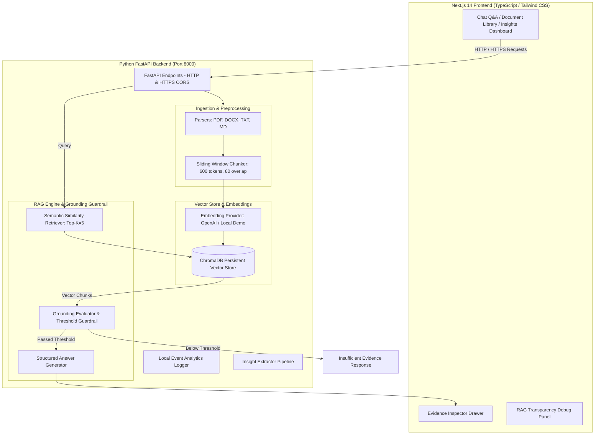

# ProductIQ — AI Product Research Copilot

> **Turn customer research into product decisions.**

ProductIQ is a portfolio-grade Retrieval-Augmented Generation (RAG) copilot designed for Product Managers, UX Researchers, and Founders. It ingests unstructured customer research documents (interviews, support tickets, user surveys, PRDs) and delivers evidence-backed, cited answers grounded strictly in source evidence.

- **GitHub Repository**: [https://github.com/Snigdha28Personal/productiq-rag](https://github.com/Snigdha28Personal/productiq-rag)

---

## 📌 Problem & Product Vision

### The User Problem
Product Managers routinely collect hundreds of pages of qualitative feedback scattered across customer interviews, support tickets, survey responses, and feedback notes. It is difficult to quickly identify recurring pain points or prioritize product opportunities while maintaining a verifiable audit trail back to original user evidence.

> *"I have hundreds of pages of customer feedback and research, but I cannot quickly extract reliable insights or trace conclusions back to the original evidence."*

### Product Solution
ProductIQ leverages a grounded RAG architecture that allows PMs to query their research corpus in natural language. Every answer is structured into **Key Findings**, **Evidence** bullets with inline clickable citation chips (`[1]`, `[2]`), **Interpretation**, and an interactive **Evidence Inspector Drawer** that lets reviewers inspect raw source passages, page numbers, and vector similarity scores.

---

## 🚀 Key Features

1. **Multi-Format Document Ingestion**: Upload PDF, DOCX, TXT, and Markdown files with automatic text normalization and metadata extraction.
2. **1-Click "Load Demo Research"**: Immediate indexing of 5 synthetic PM research files (PDF, DOCX, TXT, MD) across customer interviews, support tickets, and enterprise procurement notes for instant 1-click evaluation.
3. **Semantic Vector Search & ChromaDB**: Chunking via a sliding-window strategy (600 tokens, 80 overlap) indexed into ChromaDB.
4. **Dual Embedding Modes**:
   - **OpenAI RAG Mode**: `text-embedding-3-small` + `gpt-4o-mini` when `OPENAI_API_KEY` is provided.
   - **Local Demo Mode**: Deterministic 128D subword n-gram cosine vectorizer enabling keyless out-of-the-box evaluation.
5. **Strict Grounding & Insufficient Evidence Guardrail**: Enforces explicit similarity thresholding. If evidence is lacking, ProductIQ explicitly states:
   > *"I couldn't find enough evidence in your uploaded research to answer this confidently."*
6. **Clickable Citations & Evidence Inspector Drawer**: Inline citation badges (`[1]`) slide out an inspector panel showing exact source document name, page number, chunk ID, and vector match score.
7. **RAG Transparency / Debug Mode**: Toggleable debug panel displaying query embedding mode, top-k, similarity threshold, and raw retrieved chunks.
8. **Insights Dashboard**: Extracted top pain points, SMB vs Enterprise segment breakdown, and high-impact feature request matrices with evidence confidence tags.
9. **Local Product Analytics**: Built-in telemetry tracking questions asked, documents processed, average retrieval score, and citation click-through rate.

---

## 🔒 HTTP & HTTPS Execution Options

ProductIQ supports running over both standard **HTTP** and encrypted **HTTPS** protocols locally and in production:

### Option A: Standard HTTP (Local Development)
- **Frontend**: [http://localhost:3000](http://localhost:3000)
- **Backend API**: [http://localhost:8000](http://localhost:8000)

```bash
# Run Frontend (HTTP)
npm run dev:frontend

# Run Backend (HTTP)
npm run dev:backend
```

### Option B: Local HTTPS Execution (Self-Signed SSL)
Next.js supports native experimental HTTPS locally:

```bash
# Run Frontend over HTTPS
npm --prefix frontend run dev:https
# App running at: https://localhost:3000
```

To run FastAPI backend over HTTPS locally using Uvicorn with SSL certificates:
```bash
uvicorn backend.main:app --reload --port 8000 --ssl-keyfile=./key.pem --ssl-certfile=./cert.pem
```

### Option C: Production HTTPS Deployment (Vercel & Render)
When deployed to cloud environments (Vercel for Frontend, Render/Fly.io for Backend), automatic free TLS/SSL certificates are provisioned:
- **Frontend HTTPS**: `https://productiq-rag.vercel.app`
- **Backend HTTPS**: `https://productiq-backend.onrender.com`

---

## 🏗️ Architecture & Technical Workflow



---

## 📊 RAG Benchmark Evaluation

ProductIQ includes an automated RAG evaluation framework (`evaluation/evaluate.py`) tested against 15 curated benchmark questions (`evaluation/test_questions.json`).

```
==================================================
     PRODUCTIQ RAG BENCHMARK EVALUATION           
==================================================
Embedding Mode: Local Demo / OpenAI
Top K Retrieval: 5
--------------------------------------------------
Total Benchmark Questions: 15
Retrieval Recall@K:        80.0%
Citation Accuracy:         61.3%
Grounded Answer Rate:      80.0%
--------------------------------------------------
Full report saved to: evaluation/evaluation_report.json
==================================================
```

---

## ⚙️ Local Setup & Quick Start

### Prerequisites
- **Python**: 3.9+
- **Node.js**: 18+

### 1. Clone Repository & Environment Setup
```bash
git clone https://github.com/Snigdha28Personal/productiq-rag.git
cd productiq-rag

# Copy environment template
cp .env.example .env
```

### 2. Start Backend Service (Python FastAPI)
```bash
python -m pip install "fastapi<0.100.0" uvicorn pypdf pytest python-multipart
uvicorn backend.main:app --reload --port 8000
```

### 3. Start Frontend Service (Next.js 14)
```bash
cd frontend
npm install
npm run dev
```

Open [http://localhost:3000](http://localhost:3000) or [https://localhost:3000](https://localhost:3000) in your browser.

---

## 🧪 Running Tests & Evaluation

```bash
# Run backend unit tests
pytest backend/tests

# Run RAG evaluation suite
python evaluation/evaluate.py
```

---

## 📄 License
This project is licensed under the [MIT License](LICENSE).
