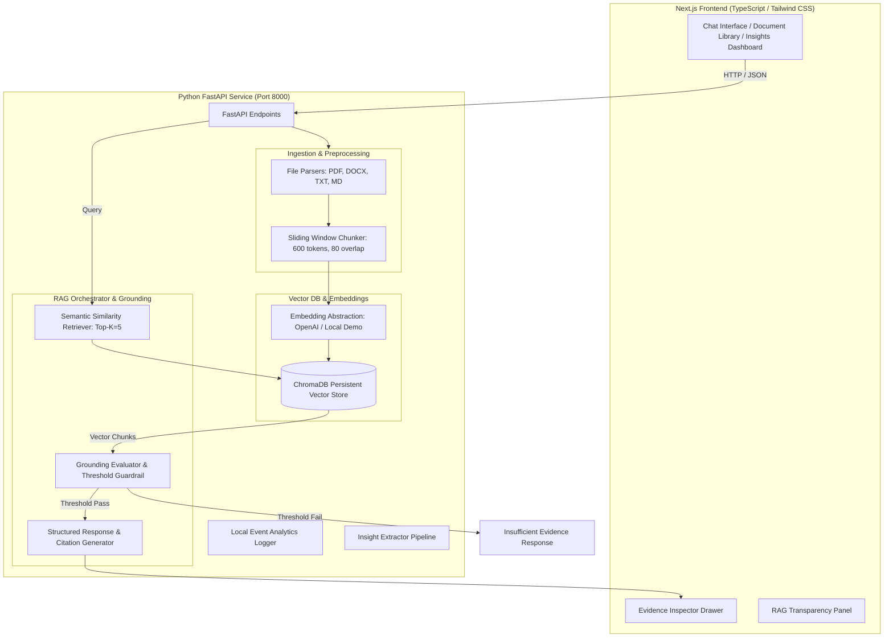

# System Architecture & Technical Design

## Architecture Diagram

## Component Breakdown

1. **Frontend**: Next.js 14 App Router with React, TypeScript, and Tailwind CSS.
2. **Backend API**: Python FastAPI providing async file upload, demo loading, vector query, and insights.
3. **Chunker**: Sliding window chunker preserving page and section context, producing deterministic IDs (`{doc_id}_c{index}_{hash}`).
4. **VectorDB**: ChromaDB cosine similarity store with fallback memory store.
5. **Grounding Guardrail**: Rejects ungrounded queries when highest similarity score falls below `SIMILARITY_THRESHOLD`.
